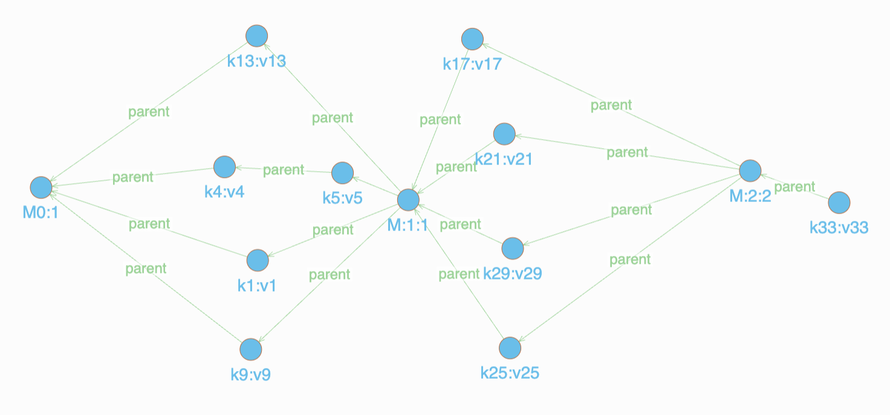
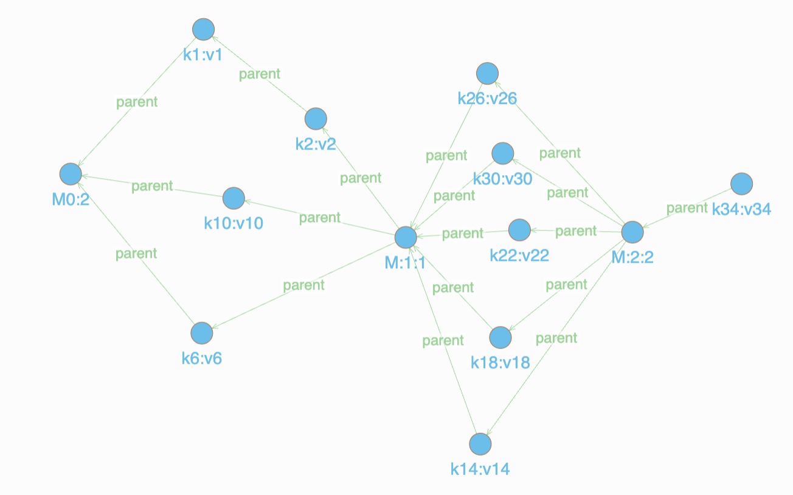
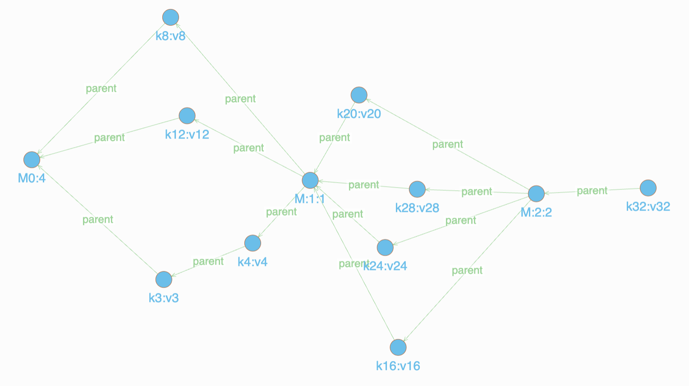

# Proof-of-Concept for PoCW (Proof-of-Causal-Work) 

This PoC is done using three nodes that communicate with one another using the libp2p as the networking layer. Each node maintains store data structure to capture the events and a vlc clock holder mapping node id to the clock value [NodeID] -> [ClockValue].

The code is developed and has been tested on the following platforms:
- Ubuntu 24.04.2 LTS
- Libp2p (for networking between nodes)
- Ethereum signature scheme

## Requirements

- Golang >= go1.23.8
- Libp2p
- Docker and Docker Compose (for Dgraph visualization)

## Setting Up Dgraph

To set up and run the Dgraph instance for visualizing the event graphs:

```bash
# Start the Dgraph services using Docker Compose
docker-compose up -d

# Verify that all services are running
docker ps

# The following services should be running:
# - dgraph_zero (port 5080, 6080)
# - dgraph_alpha (port 8080, 9080)
# - dgraph_ratel (port 8000)

# Access the Dgraph UI (Ratel) at http://localhost:8000 select the dev option.
```

## Running the Experiment

```bash
# To view results for a specific node - this command generates the graph of node 3 after the experiment
go run main.go -node=3

# To view results for other individual nodes:
go run main.go -node=1  # Generate graph for Node 1 only
go run main.go -node=2  # Generate graph for Node 2 only
go run main.go -node=4  # Generate graph for Node 4 only
```

## Visualizing Event Graphs in Dgraph Ratel UI

After running the experiment, you can visualize the event graphs using the Dgraph Ratel UI:

1. **Access Ratel UI**: Open your browser and go to http://localhost:8000
2. **Connect to Dgraph**: Make sure the connection is set to `localhost:8080` (this should be the default)
3. **Query the Event Graph**: Use the following query to view all events and their causal relationships:

```graphql
{
  events(func: has(id)) {
    uid
    id
    name
    key
    value
    node
    parent {
      uid
      id
      name
    }
  }
}
```

This query will return:
- **uid**: Dgraph's internal unique identifier
- **id**: Event ID (e.g., e1_1, e2_3, etc.)
- **name**: Event name in format "key:value" (e.g., "k1:v1", "M:1:1")
- **key**: The key part of the event (e.g., "k1", "M:1")
- **value**: The value part of the event (e.g., "v1", "1")
- **node**: Which node created this event (1, 2, 3, or 4)
- **parent**: Array of parent events showing causal dependencies

### Understanding the Graph Structure

- **Genesis Events (M0)**: Genesis Milestone with no parents
- **Key-Value Events (k1:v1, k2:v2, etc.)**: Regular data events
- **Milestone Events (M:1:1, M:2:2, etc.)**: Consensus milestones that connect to events from their respective epochs
- **Parent Relationships**: Show causal dependencies based on vector clock ordering

The visualization will display the complete causal graph showing how events are connected across all nodes in the distributed system.

## Explanation

Node 1, Node 2, Node 3 and Node 4 are the four nodes having Ethereum addresses as their libp2p IDs. Each node has a vlc clock holder that maps the node ID number to the clock value. For eg. For Node with with ID 1, may have the clock values as C = {1: 4}, that is Node 1 has clock value 4. 

The test run scenario is as follows:

Messages aka events are generated by the nodes and sent to other nodes. Each message is a key-value pair, and the nodes maintain a store to keep track of these events. Periodically, the nodes will create a milestone event that captures a consensus state of the network on a given epoc proposal. 

## Note - Proof of Causal Work - Standalone and Blockchain integration

The entities involved can generate a store/graph's mutation proof using a SNARK. For this PoC the proposing Node takes the hash as the proof of the state. The proof can be thus be proposed along with the epoc/block/milestone-transaction proposal. Now other Nodes in the system if agree with proof and proposal can send their approval votes. Upon reaching a given number of safety threshold signatures (eg. BFT number) the proposer can initiate the epoc milestone transaction. This epoc/block/milestone-transaction can then be verified by checking signatures of other Nodes already registered on the network setup or tracked by a blockchain smart contract.

    --- A Node proposes a milestone transaction/block for a Milestone
        |
        |---> (SNARK Proof + Transaction/Block proposal) ----Send----> Other Nodes to Vote
        |

        --- Other Nodes vote for the Milestone txn---

        If Votes above a threshold, eg. 2f+1 in BFT setting?
        |
        |---> (SNARK Proof + Transaction/Block proposal + Votes) --> (proposed Block/Transaction)
        |
        |---> Send to other nodes and/or a Blockchain Smart Contract
        |
        |---> If verified, added to each Node's view or to a blockchain

This PoCW logic can be implemented using a smart contract irrespective of the underlying network setup or programmable blockchain. The smart contract can be implemented for EVM or SVM or MOVE or any other compilation framework that is supported by the blockchain platform.

## 4-Node Experiment

This experiment demonstrates milestone creation in a distributed P2P network with 4 nodes using vector clocks and epoch-based consensus. The experiment is designed to create exactly 3 milestones (M0, M:1, M:2) through a controlled sequence of 35 write operations across 5 phases.

### Experiment Design

**Epoch Configuration:**
- Epoch threshold: 5 write messages per milestone
- 4 nodes with full mesh connectivity
- Vector clock-based causal ordering
- Consensus-based milestone creation with voting

**Phase Structure:**
1. **Phase 1 (Steps 1-10)**: Linear events between M0 and M:1
   - 10 write operations in round-robin fashion
   - Triggers M:1 creation after 5th write message
2. **Phase 2 (Steps 11-20)**: Events between M:1 and M:2  
   - 10 additional write operations
   - Triggers M:2 creation after 10th write message (15th total)
3. **Phase 3 (Steps 21-25)**: Additional events to ensure M:2 creation
   - 5 more write operations
4. **Phase 4 (Steps 26-30)**: Final events to guarantee milestone completion
   - 5 final write operations to ensure all nodes reach consensus
5. **Phase 5 (Steps 31-35)**: Events after M:2 milestone
   - 5 additional write operations (k31-k35) in round-robin fashion
   - Demonstrates continued operation after milestone creation

### 4-Node Experiment Results

The final states of the nodes after all 35 steps and successful milestone creation demonstrate the distributed consensus mechanism:

```
Node 1 (0x96216849c49358B10257cb55b28eA603c874b05E):
  Clock: map[1:23 2:23 3:20 4:21]
  Store: map[M0:1 M:1:1 M:2:2 k1:v1 k13:v13 k17:v17 k21:v21 k25:v25 k29:v29 k4:v4 k5:v5 k9:v9]

Node 2 (0x8Bd2395335D6984f647EEcb21F003fC8efdF018C):
  Clock: map[1:22 2:23 3:20 4:21]
  Store: map[M0:2 M:1:1 M:2:2 k1:v1 k10:v10 k14:v14 k18:v18 k2:v2 k22:v22 k26:v26 k30:v30 k6:v6]

Node 3 (0xcd09f75E2BF2A4d11F3AB23f1389FcC1621c0cc2):
  Clock: map[1:22 2:23 3:22 4:21]
  Store: map[M0:3 M:1:1 M:2:2 k11:v11 k15:v15 k19:v19 k2:v2 k23:v23 k27:v27 k3:v3 k7:v7]

Node 4 (0xA62C4BC6D1B32d44Fef7618290F478036071806C):
  Clock: map[1:22 2:23 3:20 4:22]
  Store: map[M0:4 M:1:1 M:2:2 k12:v12 k16:v16 k20:v20 k24:v24 k28:v28 k3:v3 k4:v4 k8:v8]
```

### Key Results Analysis

**Successful Milestone Creation:**
- **M0**: Genesis milestone (created automatically by each node)
- **M:1:1**: First consensus milestone created by Node 1 after 5 write messages
- **M:2:2**: Second consensus milestone created by Node 2 after 10 write messages

**Distributed Consensus Features:**
- All 4 nodes successfully synchronized the same 3 milestones
- Vector clocks show proper causal ordering with values ranging from 20-23
- Each node maintains its own subset of key-value events based on the messages it processes
- Epoch-based consensus ensures milestone creation happens at predictable intervals

**Event Distribution:**
- Each node stores approximately 8-9 regular key-value pairs plus the 3 milestones
- Events are distributed based on the P2P message routing patterns
- Vector clocks demonstrate proper causal relationship tracking across all nodes
- Phase 5 demonstrates continued network operation after milestone creation with events k31-k35

### Visualization

#### Event Graphs

The following images show the event graphs for each node, demonstrating the causal relationships between events:






#### Epoch Finalization Logs

These logs show how nodes finalize epochs as part of the consensus process:


#### Epoch Voting Logs

These logs demonstrate the voting process that occurs after epoch finalization:


#### Milestone Creation Logs

These logs show the creation and propagation of milestone events:

